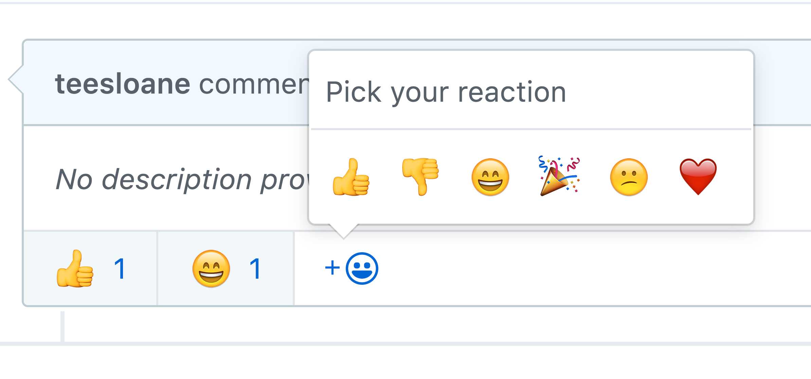

# Emojions

Welcome to one of THE HEAP's open projects! For the month of May We're building an embeddeable emoji bar. This project aims to be as accessible as possible to people who want to contribute to open source code! We've got a few things to go over, so if you're new to Github, or contributing to open source software, take a breather and then read on! You got this. 👌

Before we get into the project itself, let's get to know our collaborative environment:
- Most of the activity regarding the project's status happens _right here_ on github, especially on the [issues](https://github.com/the-heap/Emojions/issues) page. Here you can see a [roadmap](https://github.com/the-heap/Emojions/issues/1) for our project, pick out issues, and keep an eye on conversations.
- The Heap will also be making videos to document the process (live coding, demonstrations, "office hours" and so on). Subscribe to the [Youtube Channel](https://www.youtube.com/channel/UCIaeBxFZOzLA20sSAUENXRg). 
- The Heap has a [Twitter account to tweet](https://twitter.com/theheap_) both about projects and programming (and life, the universe...). Follow us to stay in the loop

For this project, our goal is to create an _embeddable emoji bar_ that users on any website can interact with. This was blatantly inspired by Github issues, and Slack. This is an example image from a Github issue page:



The above is an example of what I call a "reaction bar" — an interactive page element in which users can click on an emoji and increment it's respective counter.

# Getting Started

To contribute successfully to this project it might take a bit of time to setup and become aquainted with both the project itself and how you can best add your contributions. The following steps will inform the code you write and help you make good pull requests.

1. Understanding the [project / product](https://github.com/the-heap/Emojions/issues/1)
2. Understanding how to [contribute](./CONTRIBUTING.md)
3. Read Project Components below, for getting setup.

# Project Setup

**Snippet** : 

```sh
cd snippet
npm install
```

To run the snippet and see it working, you'll need to open the `example.html` page in the build folder to test.

**Client**

1. [Install Elm](https://guide.elm-lang.org/install.html) (follow this entire guide if you can!)
2. Go into your terminal and navigate to the folder `./client` in this repo. 
3. Run: `elm reactor`.
4. Go to `localhost:8000`. Elm should download whatever packages you need to run the project. 
5. Using elm reactor you can navigate our app. I recommend clicking on the main entry point, which should be `main.elm`. 

**Api**

// Todo


# Terminology

If you are a bit lost, the following terminology might help to clarify some aspects of the project. 

**Emoji-bar**: A container with emojis (:wave:) in it, and the corresponding number of time they have been clicked (think, facebook, slack, github isues etc).

**Snippet**: The embeddable script that allows an end user to add an "emoji bar" to their website

**Client** : Where a user can go to customize their snippet (the emoji's that show up.)

**Api** : A wrapper for the database — it allows a user of the emoji bar to store the click count ... somewhere, and then retrieve that amount when desired

# Testing Methodology

## Client

No testing yet...

## API

No testing yet...

## Snippet

Currently only the **snippet** portion has automated testing setup.

Now, the snippet is _not_ a JavaScript module, so the testing offers a challenge. It is solved by having a conditional export of each component that requires testing. You'll notice at the end of the snippet file `snippet/index.js` a series of lines that look like this:

```javascript
exports.pipe = pipe
```

This will make `pipe()` function importable from the `.test.js` files. It is set up as a conditional for when node is available.

We will be using the standard file structure for jest which includes naming test files like: `filename.test.js`

These files will be placed in the `snippet/test` directory.

Because of the small size of tested file we will be keeping test suites to single functions.

### Testing Stack

1. [Jest](http://facebook.github.io/jest/): is our testing framework.
2. [Sinon](http://sinonjs.org/): this is a standalone spy, stub, and mocking framework for JavaScript. It's useful as a test 'probe'.

### How To Add Tests

1. I've added a new function! Arg! What do I do?
2. First export the function in testing exports section at the bottom of the file: `exports.functionName = functionName`
3. Now create a new file in the `snippet/test` with the name in the format `functionName.test.js`
4. In the test file import the function `const functionName = require('../index.js').functionName`
5. The basic format for testing is: `describe('functionName()', () => it("returns X"))`
6. Nested `describes()` are allowed and encouraged.
6. The phrases attached to these syntactic functions should document their own process and the code. So try to make it as clear as possible.
5. Create unit tests! I know this is a big black box for some people. But it can't all be explained it here. Tests are created for `pipe()` as a template if you'd like! You can also check the documentation for [Jest](http://facebook.github.io/jest/) and [Sinon](http://sinonjs.org/).
6. Check coverage. When you run `yarn test` it will output a list of coverages. If you'd like specific highlights you can checkout the automatically generated `snippets/coverage` directory which will generate an easy to use webpage containing coverage information.

### Tips

- Pure functions are much easier to test.
- Functions that do one thing are much easier to test than functions that do multiple things.
- Tests can be written before your code, try writing them as a guide for what sort of code you need to end up with in the end.
- Coverage generation is only a guide, there are lots of cases you'd be better off testing that coverage checkers may not notice. Think about edge cases, and test those.

### Running tests

You can run `yarn test` or `npm test` or even just `jest` if you have it installed globally. All the configuration is found in package.json so it should be automatically handled without arguments.

# Other

- Thanks for being you
- Follow The Heap on [twitter](https://twitter.com/theheap_) and subscribe to our [youtube channel](https://www.youtube.com/channel/UCIaeBxFZOzLA20sSAUENXRg)